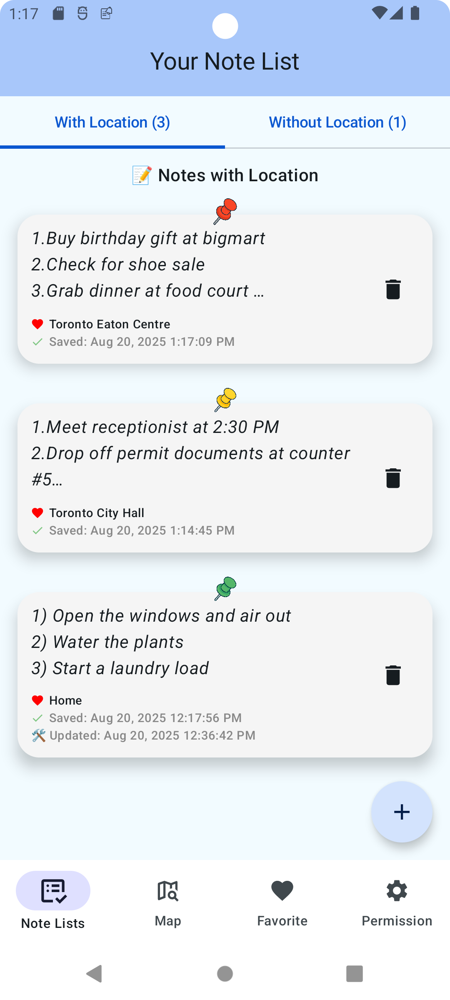
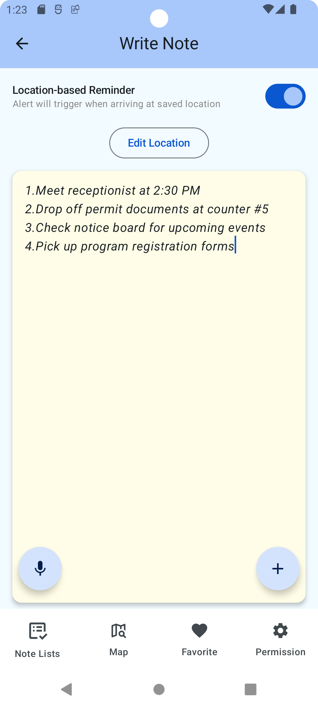
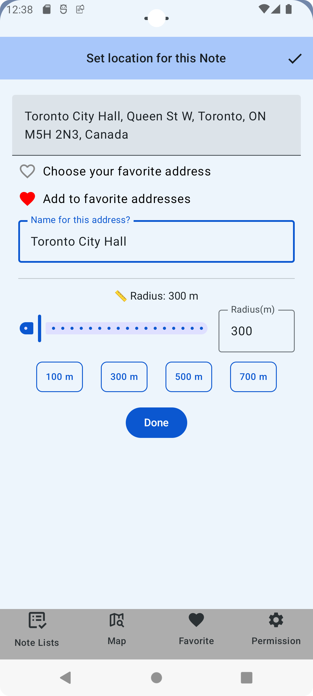
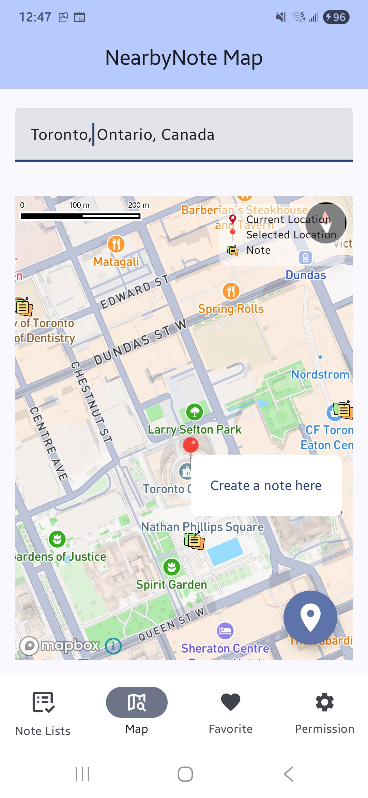
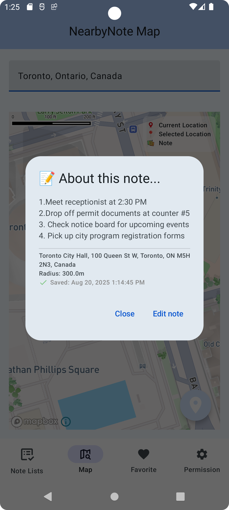
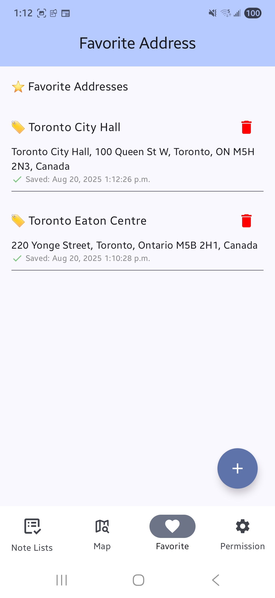

# NearbyNote

## Quick Start
1. Download the **APK** from the [latest release](https://github.com/JooHyunPark-JP/NearbyNote/releases/latest)
2. Install on your Android device.

## Screenshots
  
  
  

# App Overview

**NearbyNote** is a location-based reminder app that lets people pin notes to real-world places and get notified when they enter the area. Users can create notes from a Mapbox-powered map or by searching for an address, choose a radius for the reminder, and then view their notes either on the map or in a list. The app also supports favorite places (like home or work) for quick reuse and voice input for creating notes hands-free.

**Example Use Cases:**
- Arriving at the office → “Prepare for today’s meeting”
- Getting to the grocery store → “Buy fruits and eggs”
- Reaching home → “Open the windows”
  
---

## Key Features

### 1. Note Creation
- Create notes via text or voice (currently defaults to English)
- Uses Android SpeechRecognizer to convert voice to text

### 2. Location-Based Notes Notifications
- Set a location and geofence radius per note
- Notifications fire on ENTER events

### 3. Map Integration
- Map UI powered by Mapbox Maps SDK (v11)
- Address search powered by Mapbox Geocoding API
- Create notes by tapping on the map or searching for an address
- View notes by saved location

### 4. Saved Places (Favourites)
- Save frequently used addresses; reuse when creating new notes

### 5. Reliable in the Background
- No persistent foreground service
- Works after app termination, reboot, and in background
- Uses Google Play services Geofencing, BroadcastReceivers
- Uses optimized Android APIs (Geofencing + Google Play Services Location), designed for low battery usage
- Periodic `WorkManager` job to reconcile/re-register geofences

### 6. Permissions Management UI
- Dedicated screen showing Location / Background Location / Notifications / Microphone status

---

## Architecture & Reliability (Summary)

- **Architecture:** MVVM with Hilt-injected repositories; Compose screens observe state from ViewModels while repositories hide Room, Mapbox, and the Android Geofencing API behind testable interfaces.
- **Room as single source of truth:** One Room database stores notes, geofences, and saved addresses; DAOs expose Flows that feed both the UI and background workers.
- **Background reliability:** A geofence reconcile worker, triggered by boot/package-replaced broadcasts, re-registers geofences after reboots or Play Services updates so reminders keep working without a foreground service.
- **Permissions & privacy:** Foreground/background location and notification access are requested with clear rationale screens and a linked privacy policy to keep location usage transparent.
- **Testing & CI/CD:** Core note/geofence logic is unit-tested at the repository/ViewModel layer, and GitHub Actions runs tests on each push; a release workflow builds a signed release and uploads it to Google Play console when pushing to the `release` branch.

## Tech Stack

| Category         | Technology |
|------------------|------------|
| UI               | Jetpack Compose (Material 3) |
| Architecture     | MVVM, Hilt (DI) |
| Storage          | Room Database |
| Async            | Kotlin Coroutines, Flow |
| Maps & Location  | Mapbox Maps SDK (v11), Mapbox Geocoding API, Google Play Services Location (Geofencing) |
| Voice            | Android SpeechRecognizer |
| Network          | Ktor + kotlinx.serialization |
| Background Tasks | BroadcastReceiver, WorkManager (reconcile), Notifications (no foreground service) |
| Permissions      | Accompanist Permissions |
| Testing          | JUnit, MockK, Turbine |
| CI/CD            | GitHub Actions |
